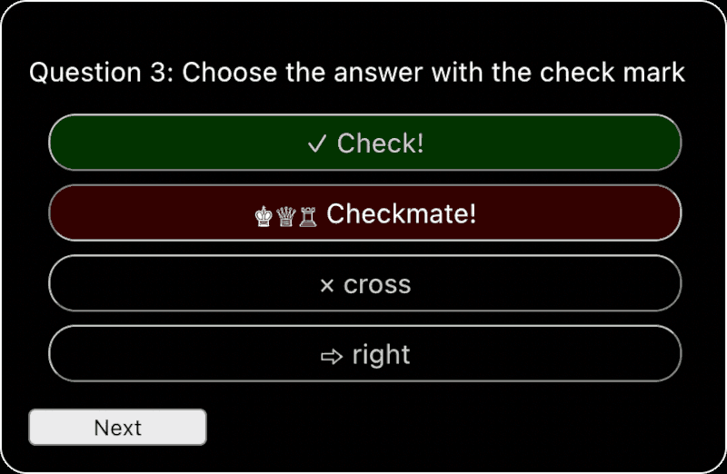
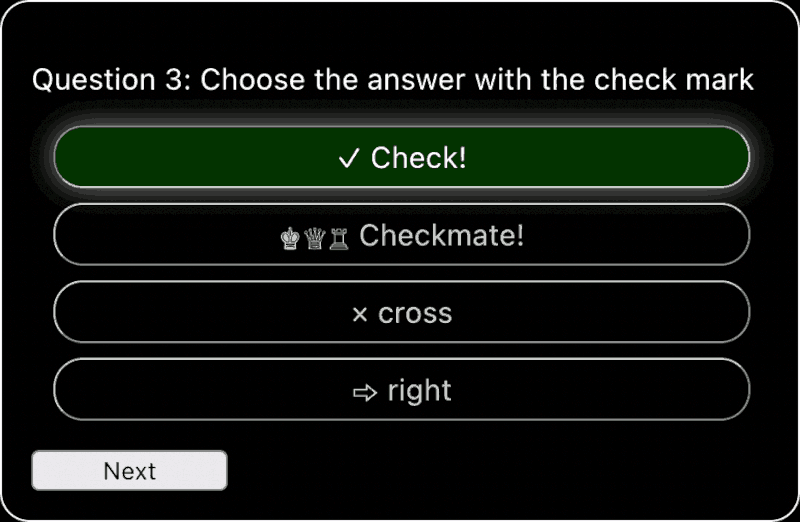

# Quiz Step-by-Step

## Step 3 Completed

Your third task was to adapt the Next button and the answer list items, so that the player can see if they gave the right answer. In this branch, this has been done for you. As requested:

* The Next button is disabled until the player chooses an answer
* The Next button is renamed "Check Answer" when an answer is selected
* When Check Answer is pressed:
  - The correct answer is highlighted in green
  - If the selected answer was wrong, it is highlighted in red
  - The player can no longer change the answer
  - The button is renamed "Next" once again
* The next question is shown when Next is pressed

## Step 4: Show answers in a random order

Up until now, the answers have been shown in the order in which they appear in the `src/data/questions.json` file.

Your fourth task is to present the answers in a random order.

* The first answer is flagged as correct
* The order of answers is randomized (in the App component)
* The Answers component uses the `correct` flag to determine whether the player chose the right answer.

Your third task is to adapt the Next button and the answer list items, so that the player can see if they gave the right answer. You'll need to edit both the Question and the Answer components.

* Disable the Next button until the player chooses an answer
* Rename the Next button to "Check Answer" when an answer is selected
* When Check Answer is pressed:
  - Highlight the correct answer
  - Indicate that the selected answer was wrong, if the player did not select the correct answer
  - Prevent the player from changing the answer
  - Rename the button to "Next"
* Go to the next question when Next is pressed


*<p align="center">The Check Answer button</p>*

*<p align="center">The result of clicking Check Answer if the answer is wrong</p>*

*<p align="center">The result of clicking Check Answer if the answer is right</p>*

---

## One Step at a Time

At this stage, just focus on confirming whether the currently selected answer is correct. For now, the correct answer will always be the first answer. You can deal with putting the answers in a random order and other issues at a later stage.

## Tips

1. Use `useState` in your Question component to:
   - Store the currently selected answer
   - Set a flag if the Check Answer button has been pressed
2. Create a function in your Question component that will return a button with the appropriate and the appropriate `onClick` event listener, depending on whether an answer has been selected and whether the Check Answer button has been clicked.
3. Create a new function in your Question component that will be called when an answer is pressed
4. Use props to pass this function to the Answers component, so that it the radio buttons can use it as the event listener for `onChange`
5. Create a new function to act as a click event listener for the Check Answer button
6. Pass the selected answer and the checked state to the Answer component, so that you can set a class for any labels that need to have a different style after the player clicks Check Answer
7. You can use the CSS rule `pointer-events: none` to prevent mouse or touch actions on a given element, or on any of its children.
8. The text of the Next/Check Answer button will change. Your page will look better if its width doesn't change because of this.


## Potential Gotchas

1. Think about CSS specificity when you are creating the rulesets for answers after Check Answer is pressed. You can use [this Specificity Calculator](https://specificity.keegan.st/) to check which selector will take precedence.

   Your selector for the clicked element might currently look something like this:

   ```css
   input[type="radio"]:checked + label
   ```

   The [Specificity Calculator](https://specificity.keegan.st/) calculates this as:
   * 0 ids
   * 2 Classes, attributes and pseudo-classes
   * 2 Elements and pseudo-elements

    The selector that you use to show if this answer is right or wrong must have at least the same specificity, otherwise it will be overruled.

2. After the player has selected an answer and press Check Answer, any `useState` variables that you have used will already have a non-default value. If you show the next question without resetting them to their default values, the next question will show in a non-default state.

   How can you reset your `useState` values before showing a new question?
