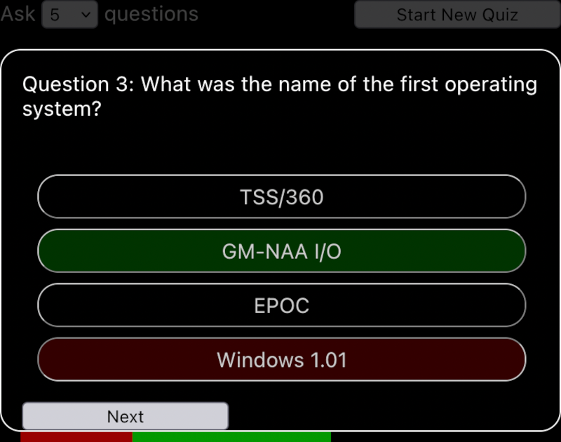

# Quiz Step-by-Step

## Step 5 Completed

Your fifth task was  to allow the player to choose how many questions they want to answer, and to select these questions randomly from a long list of questions. In this branch, this has been done for you. As requested:

* There is a new component called `HowManyQuestions` which displays:
  - A `<select>` element where the player can choose how many questions to answer
  - A Start New Quiz `<button>`.
* When the player clicks on Start New Quiz:
  - The `<select>` element and the `<button>` are disabled
  - The quiz starts with the selected number of questions
* When the last question has been answered, the `HowManyQuestions` component is reactivated so that the player can start a new quiz.
* No question is reused unless all the questions have been answered
* The answers are shown in a random order each time each question is asked.

## Step 6: Show a progress bar with the number of correct and incorrect answers

Your sixth task is to create a `Score` component to show a progress bar:

* The bar will show what percentage of questions have been answered.
* The percentage of correct answers will appear in green; the percentage of incorrect answers will appear in red.
* The progress bar should update as soon as the player clicks Check Answer.

---

## Tips

1. You can show the progress bar as a `
` element that has the same width as the `Question` component. Inside this parent `
` you can show child `
` elements whose width is defined in `%` units of the parent's width.
2. You can show the percentage of questions that have been _answered_ in green, and overlay this bar with a red bar that shows the percentage of _wrong_ answers. The visible part of the "questions answered" bar will represent the number of questions _answered correctly_.
3. You will have to pass three numbers to the `Score` element:
   * The total number of questions in the current quiz
   * The number of questions already answered
   * The number of wrong answers given
  
   The component that is the parent of the `Score` component will need to obtain these values from somewhere.
4. The `App` component already has a variable called `questions`, whose `.length` property you can use.
5. The `Answers` component has a `correct` flag for each answer, and it can communicate this to the `Questions` component each time an answer is selected.
6. You can edit the `Answers` component so that it stores this information and sends it to the `App` component when the Check Answer button is pressed.
7. The `App` component will need to provide an additional callback function to update the number of questions, and how many of these answers were wrong.
8. To set the width of a `
` element to an arbitrary value, you can used the `styled-components` module.
9. To set a width programmatically inside a `styled` component, you can use a rule like
   `width: ${props => props.wrong * 100 / props.total}%;`
10. You can create [Custom CSS Properties](https://developer.mozilla.org/en-US/docs/Web/CSS/--*) like `--height: 1em` and access them in CSS rules like `height: var(--height)`. This allows you to apply the DRY principle (Don't Repeat Yourself). You can declare a value in one place and use it in several places.
11. You can declare such Custom CSS Properties in your CSS file, and use them in your `styled` components.

## Potential Gotchas

1. No score should be shown if the player hasn't started a quiz yet.
2. How can you show one `
` element _on top of_ another?