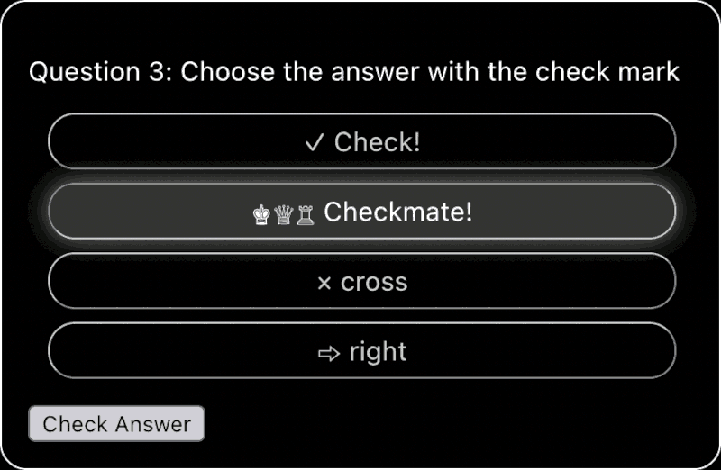

# Quiz Step-by-Step

## Step 3 Completed

Your third task was to confirm if the answer is correct before moving to the next question. In this branch, this has been done for you. As requested:

* The Next button initially appears disabled
* The button text changes to "Check Answer" when an answer is selected
* When Check Answer is pressed:
  - The correct answer is shown in green
  - If the selected answer was wrong, it is shown in red
  - The player cannot change the answer any more
  - The button text reverts to "Next"
* The state of the Question component reverts to defaults when Next is pressed 

## Step 4: Present the answers in a random order

Currently, the answers are all shown in the order in which they appear in the `questions.json` file. This file uses the convention that the right answer always appears first.

Your fourth task is to show the answers in a random order.

*
The Check Answer button
*

---

## One Step at a Time

At this stage, just focus on randomizing the order of the answers. For now, it's enough to test with the same three placeholder questions. You can add more questions and deal with other issues at a later stage.

## Tips

1. 

## Potential Gotchas

1. 
