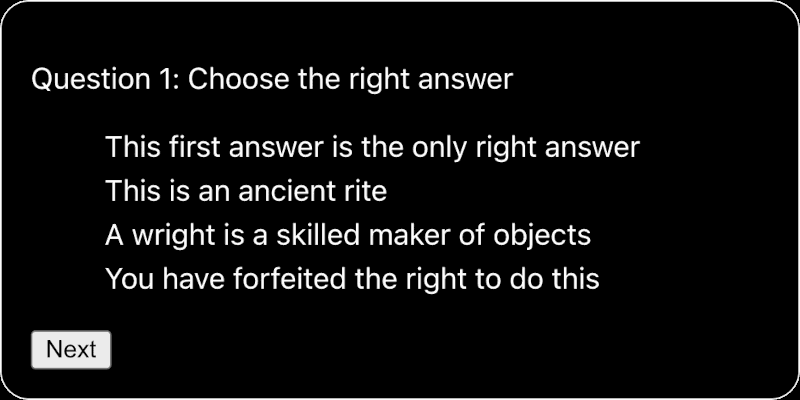

# Quiz Step-by-Step

In this series of assignments, you will be creating a React quiz game app where:

* The player will be asked a series of multiple choice questions
* When the player confirms their answer, the correct answer is shown
* The answers are displayed in a random order
* The player can choose how many questions to answer
* The chosen number of questions are selected at random from a long list of questions
* If the player decides to start a new quiz, questions that have already been seen will not be shown again until all questions have been seen.

---
## Step 1: Displaying questions and answers

This repo contains an array of questions in the file `src/data/questions.json`. There are only three questions for now. There will be more later.

Each question has the form:
```json
{ "question": "The text of the question",
  "answers": [
    "The first answer is always correct",
    "Other answers...",
    "... are intended...",
    "... as decoys"
  ]
}
```

Your first task is to create a Question component which will display one question and its answers, along with a Next button.

* The answers should be shown in the same order as they are given in the `questions.json` file
* Clicking on the Next button should cycle through the questions in order.

Your app could look something like this when you have finished this step:
<br />
<br />



---

## One Step at a Time

At this stage, just focus on the layout of each question and its answers. For now, you **don't** need to provide a way for the player to indicate the right answer or to show the score. You can deal with these and other issues at a later stage.

## Tips

1. You can use `import questions from './data/questions'` to set a `questions` variable to the value of contents of the `questions.json` file.
2. You can use `useState` to store the index of the current question
3. You can use the `%` mod operator to set the index value back to 0 if you increment it to a value higher than the highest index in an array.
4. You can create a `Questions` component in a separate file, and import it into your `App.js` file.
5. You can send props to the `<Questions />` component, to define what question to show, what answers to show, and what function to call when the Next button is clicked.
6. You can map the answers to `<li>` items inside a `<ul>` element
7. You can use `index.css` to define the styles for the different HTML elements

## Potential Gotchas

1. The questions and answers are of different lengths. How can you set the CSS so that the text does not move around between one question and the next?
2. Question 3 contains emoji characters. These may affect the line height of the displayed answers, which may make the layout shift slightly when the user moves to Question 3 and back to Question 1

