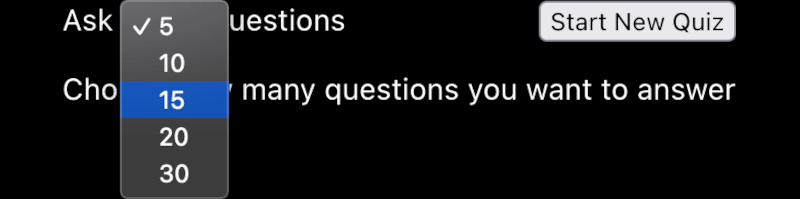

# Quiz Step-by-Step

## Step 4 Completed

Your fourth task was to present the answers in a random order. In this branch, this has been done for you. As requested:

* The first answer is flagged as correct
* The order of answers is randomized (in the App component)
* The Answers component uses the `correct` flag to determine whether the player chose the right answer.

## Step 5: Select a shortlist of questions randomly from a longer list

Up until now, you have been testing with only three placeholder questions.

Your fifth task is to allow the player to choose how many questions they want to answer, and to select these questions randomly from a long list of questions.

For this exercise, you have a list of 15 questions taken from the public [Ultimate Quiz Questions](https://www.ultimatequizquestions.com/multiple-choice-trivia-questions/) page and another 15 from [their technical quiz](https://www.ultimatequizquestions.com/technology-quiz/#more-1808) (and revised for accuracy). You may prefer to use a longer list of your own questions.

* Create a component called HowManyQuestions
* Use it to display a `<select>` element with an arbitray number of `option` elements, each of which shows the number of questions that will be chosen
* Include a Start New Quiz button.
* When the player clicks on Start Quiz:
  - Prevent any further clicks on the `<select>` and `<button>` elements
  - Select the appropriate number of questions, in a random order, from the long list of available questions
  - Start the quiz
* When the last question has been answered, reactivate the HowManyQuestions component
* If a new quiz is started, make sure that no question is asked again unless all questions have already been answered.

---

*
Choose the number of questions
*

*
Random question order
*

*
Invitation to play again
*

---

## One Step at a Time

At this stage, just focus on choosing a given number of questions in a random order. You deal with showing the score and other issues at a later stage.

## Tips

1. Up until now, the `App` component has simply imported a placeholder list of questions. Now, you can create a separate `randomQuestions` script which:
   - Imports all the questions from the `src/data/questions.json` file
   - Shuffles the questions
   - Exports:
     - the total number of questions
     - a `getQuestions` function to select a given number of shuffled questions.
2. Up until now, the `App` component also took care of shuffling the answers of each question. You can in fact move _all_ the shuffling tasks to the `randomQuestions` script.
   - It can flag which answer is correct for each question as soon as all the questions are loaded from the `src/data/questions.json` file
   - It can shuffle the answers to each question each time the question is asked.
3. You can import the `getQuestions` function exported from your `randomQuestions`  into the `App` component.
4. The `App` component can call the imported `getQuestions` function to obtain the list of questions to use.
5. The `App` component will get this information from the `HowManyQuestions` component.
6. The `HowManyQuestions` component will need to know two things:
   - What function to call in the `App` component, in order to trigger the `getQuestions` function with the right number of questions as its argument.
   - Whether the player is actively answering the quiz questions, or choosing how many questions to answer.
7. The `HowManyQuestions` component might also want to know the maximum number of questions that can be asked in any one quiz.
8. You can wrap the `HowManyQuestions` component in a `
`. You can use the CSS rule `pointer-events: none;` on this `
` to prevent any mouse or touch interaction with it while the quiz is in progress. (You did something similar in the `Answer` element to prevent the player from changing their answer after showing the right answer.)
9. The `App` component will need to be reworked
   - It will need to display two components: the `HowManyQuestions` component and the `Question` component
   - The array of questions will not be known until the player has selected the number of questions and clicked on the Start New Quiz button
   - The array of questions will be obtained by a call to a function imported from a different script
   - When all the questions have been answered, the quiz should stop and the player should be given the choice of starting again with a different number of questions.

## Potential Gotchas

1. What will happen when the player has taken the quiz enough times to have answered all the questions? Can you recycle the questions in a different order?
2. Suppose your client wants you to change the number of questions that can be chosen. Can you make it very simple for yourself to modify these numbers?
3. Does the `randomQuestions` script need to be a React component? Where would be a good place to store it?