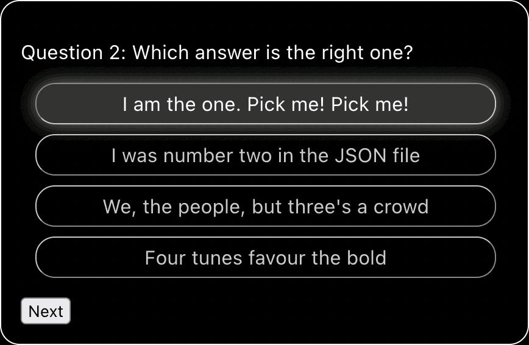

# Quiz Step-by-Step

## Step 1 Completed

Your first task was to create a Question component which will display one question and its answers, along with a Next button. In this branch, this has been done for you. As requested:

* The answers are shown in the same order as they are given in the `questions.json` file
* Clicking on the Next button cycles through the questions in order.

## Step 2: Provide visual feedback when an answer is selected

Your second task is to create an Answers component, where each answer is displayed as a radio button, so only one answer can be selected at a time.

* Create an Answers component
* Send the `answers` data for the current question as `props` to the Answers component
* Display each question as the label for a radio button
* Present these elements in list items in an unordered list
* Use CSS to hide the radio button itself
* Use CSS to make the selected answer change its look when pressed



---

## One Step at a Time

At this stage, just focus on the visual feedback when the player selects an answer. For now, you don't need show whether the selected answer is correct or not. You can deal with these and other issues at a later stage.

## Tips

1. You can create a list item with the format:

```html
<li>
  <input type="radio" name="answer" id="unique-id" .../>
  <label htmlFor="unique-id"...>
    Answer text goes here
  </label>
</li>
```
   You can then use the `+` "next sibling" selector to change the style of the label when its associated radio button is pressed:

```css
input[type="radio"] + label {
  /* Style for selected answer */
}
```
2. You can set the width of the radio button and its opacity to 0 to hide it.
3. It would be possible to create the same feature without using radio buttons, but it would require more work.

## Potential Gotchas

1. React will complain if the `<li>` answer items don't each have their own unique `key`. React uses the `key` to recognize an element that is queued for re-rendering is already showing, in which case, it can take shortcuts.

   So what happens if you use a key like `"answer" + index`, where `index` is the index of the list item? Try it and see. Click on an answer and then click on your Next button.

   If the same `key` is used for a list item in the same list, React might think that it is the _same_ list item, even if its text has changed.

   You could use the text of the answer itself, or a custom key like `"QxAy"` where `x` is the question number and `y` is the answer index. (How would you pass the question number to the Answers component?)

